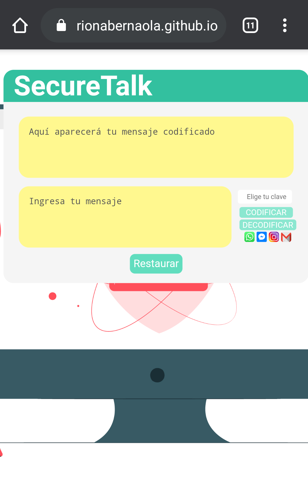

# :lock: **SecureTalk**

## Índice

* [1. ¿Qué es?](#1-¿qué-es?)
* [2. ¿Cómo funciona?](#2-¿cómo-funciona?)
* [3. ¿Cómo se desarrolló?](#3-¿cómo-se-desarrolló?)
* [4. ¿Qué es el cifrado César?](#4-¿qué-es-el-cifrado-César?)
* [5. Consideraciones técnicas](#5-consideraciones-técnicas?)

# 1. ¿Qué es?

No cabe duda que la comunicación a través de internet está cada vez más presente en nuestro día a día, sin embargo, *¿cuántas veces nos hemos sentido seguros al compartir información que es confidencial para nosotros?* :worried:

Ya sea desde un secreto :zipper_mouth_face: hasta una gran idea de negocio :bulb:, todos merecen ser protegidos.

:point_right: Por ello en SecureTalk hemos desarrollado una web app en la que podrás intercambiar mensajes codificados :lock: mediante el uso de una clave :key: que solo tú y tu contacto conocerán.

**Ingresa a [SecureTalk web app](https://marycieloparionabernaola.github.io/LIM013-cipher/src/index.html).**

# 2. ¿Cómo funciona?

La pantalla de inicio mostrará un mensaje de bienvenida e indicará instrucciones a tener en cuenta.

Existen dos versiones: FREE y PLUS.

Al presionar en "Plus SecureTalk" o "Iniciar sesión" aparecerá una pantalla de login donde podrás elegir el avatar que desees, tendrás que ingresar lo siguiente.

Usuario: **user**

Contraseña: **user**

Los pasos para ambas versiones son las mismos:

1. Ingresa el mensaje :email: y clave :key:

2. Presiona el candado cerrado :closed_lock_with_key: para codificar/ocultar

   Presiona el candado abierto :unlock: para decodificar/mostrar :eyes:

3. Para borrar los datos, presiona reiniciar :repeat:

Diferencias en las versiones:

* Free: tienes hasta 10 claves.

* Plus "de paga": tienes hasta 25 claves, botón de Gmail y enviado automático por Whatsapp.

# 3. ¿Cómo se desarrolló?

SecureTalk nace a partir de la elección del [proyecto Cipher](https://github.com/Laboratoria/LIM013-cipher) como primer trabajo encargado en el bootcamp para la promoción N°13 de Laboratoria.

* Duración: dos semanas y media.
* Metodología: Design Thinking, aplicándose las etapas: Empatizar, Definir, Idear, Prototipar y Testear durante todo el proceso.
* Tipo de cifrado: César.
* Lenguaje de marcado: HTML.
* Estilos: CSS.
* Lenguaje de programación: Vanilla Javascript.

## 1. Empatizando

Se aplicaron las técnicas de Brainstorming y entrevistas a 05 personas. Se determinó lo siguiente:

**Usuario**: persona que se comunica a través de internet y requiere de mayor privacidad y protección de sus mensajes, la finalidad del mismo puede clasificarse en:

* **Económicos**: protección de ideas, mensajes sobre dinero, transacciones y gestiones realizadas con clientes y/o socios.

* **Personales**: protección de mensajes confidenciales enviados a través de las redes sociales y que podrían ser expuestos.

## 2. Definiendo

Se definió el problema y la solución al mismo.

## 3. Ideando

Se identificaron las necesidades específicas de los usuarios mediante entrevistas, las cuales se plasmaron en un [mapa de ideas](https://miro.com/app/board/o9J_koWZA1o=/) realizado en la aplicación Miro.

## 4. Prototipando

Primero se realizó el bosquejo en papel:

Se recibió el siguiente **feedback:**

* Monetizar web app.
* Agregar login para usuarios ya registrados.
* Resaltar el botón restaurar.

Luego se realizaron dos prototipos en ppt, siendo el último:

 

Posteriormente se realizó el [diagrama de flujo de SecureTalk](https://miro.com/app/board/o9J_koMjprg=/) en la aplicación Miro, el cual se modificó con la última iteración.

## 5. Testeando

Se realizó una constante iteración de todo el proceso.

**Primer prototipo funcional publicado en GithHub pages:**

**Primer feedback:**

* La caja se mostraba grande y el usuario tenía que reducirlo manualmente.
* La imagen de fondo no se apreciaba en la versión móbil.
* Íconos en vez de textos en botones (codificar, decodificar y restaurar)
* Necesidad de una explicación sobre funcionalidades en la primera pantalla o colocar una demo.
* Necesidad de cifrar números.

Se decidió realizar las mejoras y además se modificaron los estilos y estructura de la ventana de cifrado. Así como la aplicación del diseño Mobile First. Y se testeó con el usuario.

**Segundo prototipo funcional publicado en GithHub pages:**

**Segundo feedback:**

* Colocar la caja de ingreso de mensaje en la parte superior.
* Emplear palabras como "ocultar, mostrar y reiniciar" por ser más cercanas a los usuarios y que estos sean más grandes.
* Cambiar el ícono de escoba por uno parecido al de actualizar para el botón reiniciar.

Además de las mejoras agregadas, en cuanto a colores, el usuario prefirió que estos fueran como el último prototipo realizado en ppt.

**Último prototipo y feedback:**

El último prototipo es similar al 
[MVP (Producto Mínimo Viable) de este proyecto](#2-¿cómo-funciona?) presentado líneas arriba, solo se le hizo las siguientes mejoras:

* Login con avatar femenino y masculino (checkbox), al inicio solo había una imagen de avatar masculino.
* Apariencia mejorada en navegador Firefox.

# 4. ¿Qué es el cifrado César?

Cifrar significa codificar. El [cifrado César](https://en.wikipedia.org/wiki/Caesar_cipher)
es uno de los primeros métodos de cifrado conocidos. El emperador romano Julio
César lo usaba para enviar órdenes secretas a sus generales en los campos de
batalla.

El cifrado césar es una de las técnicas más simples para cifrar un mensaje. Es
un tipo de cifrado por sustitución, es decir que cada letra del texto original
es reemplazada por otra que se encuentra un número fijo de posiciones
(desplazamiento) más adelante en el mismo alfabeto.

Por ejemplo, si usamos un desplazamiento (_offset_) de 3 posiciones:

* La letra A se cifra como D.
* La palabra CASA se cifra como FDVD.
* Alfabeto sin cifrar: A B C D E F G H I J K L M N O P Q R S T U V W X Y Z
* Alfabeto cifrado: D E F G H I J K L M N O P Q R S T U V W X Y Z A B C

En la actualidad, todos los cifrados de sustitución simple se descifran con
mucha facilidad y, aunque en la práctica no ofrecen mucha seguridad en la
comunicación por sí mismos; el cifrado César sí puede formar parte de sistemas
más complejos de codificación, como el cifrado Vigenère, e incluso tiene
aplicación en el sistema ROT13.

# 5. Consideraciones técnicas

##### `src/index.html`

Este es el punto de entrada de la web app en HTML.

##### `src/free-secure-talk.html`

Esta es el HTML para la página Free.

##### `src/plus-secure-talk.html`

Esta es el HTML para la página Plus.
  
##### `src/cipher.js`

Aquí está implementado el objeto `cipher`, el cual contiene lo siguiente:

- `cipher.encode(offset, string)`: `offset` es el número de posiciones que queremos mover a la derecha en el alfabeto y `string` el mensaje (texto) que queremos cifrar.
- `cipher.decode(offset, string)`: `offset` es el número de posiciones que queremos mover a la izquierda en el alfabeto y `string` el mensaje (texto) que queremos descifrar.

##### `src/free.js`

Aquí escuchamos eventos del DOM e invocamos `cipher.encode()` o `cipher.decode()` mediante la importación del objeto `cipher` para `src/free-secure-talk.html`.

##### `src/plus.js`

Aquí escuchamos eventos del DOM e invocamos `cipher.encode()` o `cipher.decode()` mediante la importación del objeto `cipher` y añadimos otras funcionalidades propias para `src/plus-secure-talk.html`.

##### `test/cipher.spec.js`

Se implementaron tests para `cipher.encode()` y `cipher.decode()`.

Los tests unitarios debían cubrir un mínimo del 70% de _statements_, _functions_ y _lines_, y un mínimo del 50% de _branches_ aplicándose los mismos con el comando `npm test`.

Los resultados del test fueron los siguientes:

**Nota**:

* La lógica del proyecto está implementada commpletamente en JavaScript. En
este proyecto NO estaba permitido usar librerías o frameworks, solo JavaScript puro también conocido como Vanilla JavaScript.

* No se utilizó la _pseudo-variable_ `this`.

- - -

## Muchas gracias :)